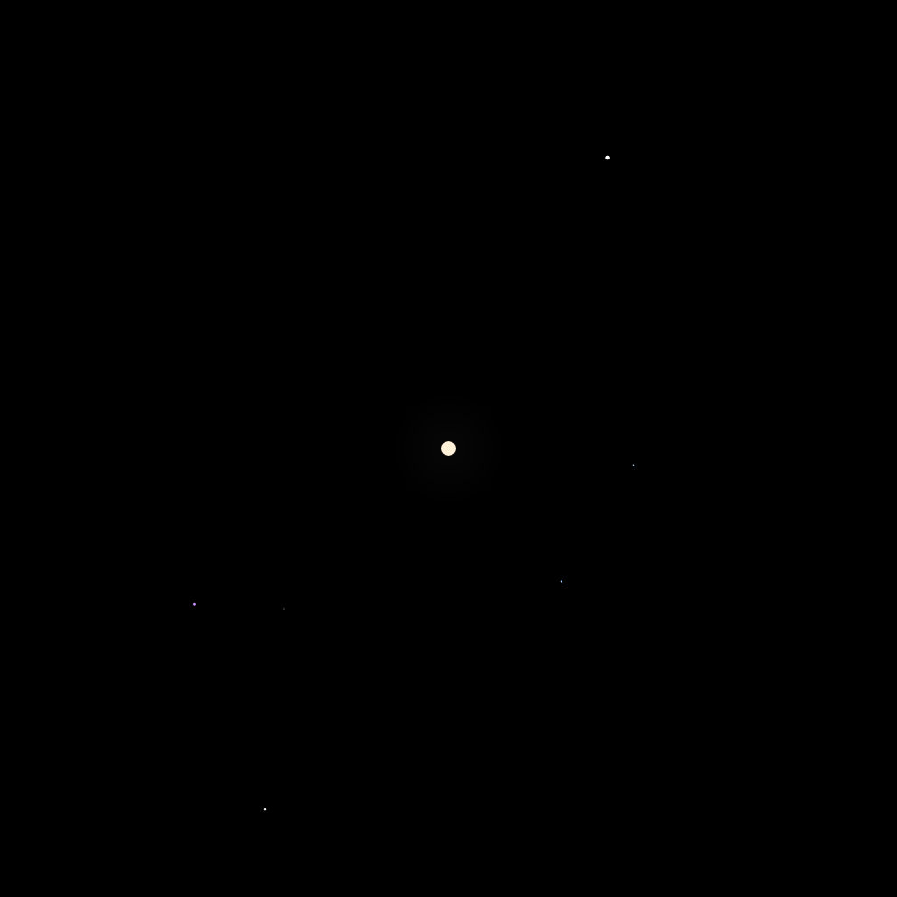
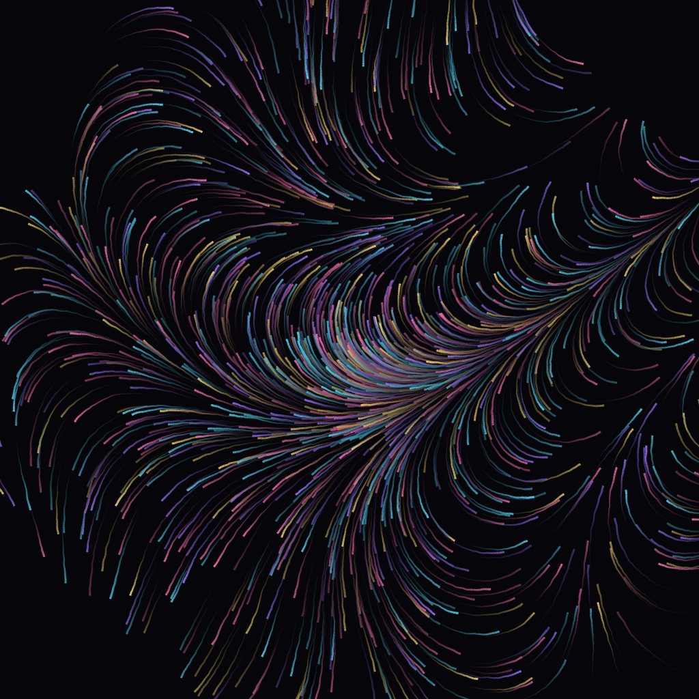
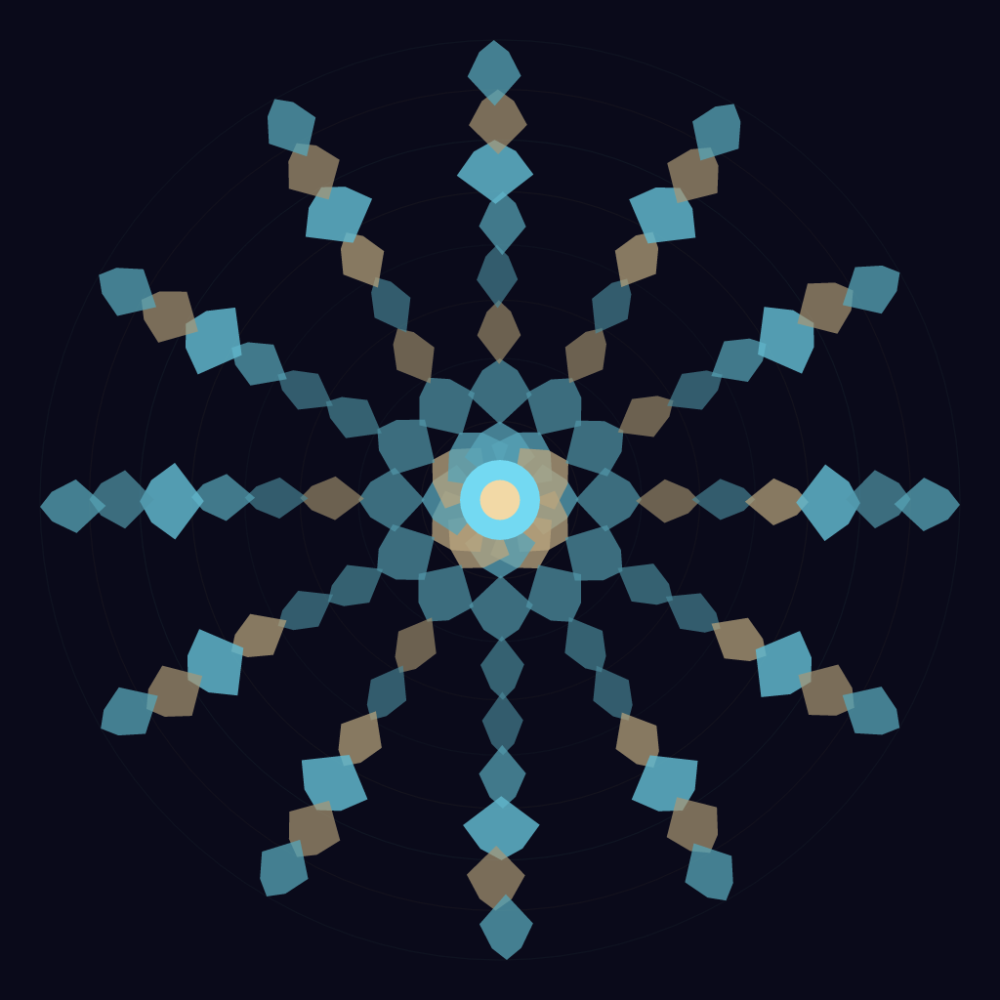

<div align="center">

# 🌱 seed-canvas

**Seed is the Artwork.**

Open-source, self-hostable, deterministic generative-art platform — built in Rust.

[](https://github.com/EZfan/seed-canvas/actions/workflows/ci.yml)
[](https://ezfan.github.io/seed-canvas/)
[](./LICENSE)
[](https://blog.rust-lang.org/2024/07/25/Rust-1.80.0.html)



**Three built-in templates, three seeds — every image below was rendered by the same binary:**

| `galaxy` / seed `cosmos` | `particles` / seed `aurora` | `mandala` / seed `bloom` |
| :---: | :---: | :---: |
|  |  |  |

</div>

## What is it?

`seed-canvas` lets you generate artwork from a **seed string**.
The same seed + template + parameters always produces the same image — on
every platform, in every supported format, byte for byte.

- **`cosmos`** at `1024×1024` PNG, on Linux, macOS, Windows, and WASM — the
  same pixels.
- `cosmos` as SVG, JSON, or embeddable HTML — all from the same seed.
- No server-side randomness, no clocks, no hidden state. **The seed is the
  artwork.**

It is an open-source answer to [fxhash](https://fxhash.xyz), designed to
run on your laptop, your server, or your laptop as a server — with the
entire gallery under your control.

## Features

- 🎨 **Deterministic by design** — SplitMix64 + SHA-256 domain separation;
  same seed always means the same artwork.
- ⚡ **Fast** — `tiny-skia` rasterizes 1024×1024 PNGs in milliseconds.
- 🧩 **Composable templates** — every template is a Rust entry function with
  a JSON-Schema-validated parameter object.
- 🖼 **Multi-format output** — `png`, `svg`, `json`, with byte-stable
  encoders.
- 💾 **SQLite-backed gallery** — every render is indexed with FTS5 search.
- 🔌 **Adapter-based** — server, canvas2d, webgl, webgpu, and svg backends
  share one `Surface` trait.
- 🛠 **CLI-first** — `init`, `render`, `share`, `list`, `random`, `verify`,
  `doctor`, `url` — all designed to be scriptable.
- 🔒 **Local-first & self-hostable** — no telemetry, no cloud lock-in.
- 📦 **Single binary distribution** — `cargo install seed-canvas-cli`.

## 5-line quickstart

```bash
# 1. Install (requires Rust ≥ 1.80).
cargo install seed-canvas-cli

# 2. Render your first artwork.
seed-canvas render --template galaxy --seed cosmos --out cosmos.png

# 3. Get a shareable canonical URL.
seed-canvas share --template galaxy --seed cosmos --out cosmos.png
# → https://art.example.com/p/galaxy/sc_1eebd7175c6b0b26921647f4

# 4. Initialize a gallery workspace.
seed-canvas init my-gallery && cd my-gallery

# 5. Verify determinism (same seed → same hash).
seed-canvas verify --template galaxy --seed cosmos
# → 3fab6d24ddbd8051…  ✓
```

Or browse your renders in a browser with the built-in gallery server:

```bash
seed-canvas serve                  # → http://127.0.0.1:8080
```

## Why?

> "What if the URL is the artwork?"

Generative-art platforms usually tie you to a single chain, a single
server, or a single web framework. `seed-canvas` says: **the URL is the
artwork, and the artwork is yours.** A URL like
`/p/galaxy/sc_1eebd7175c6b0b26921647f4` is a stable, content-addressed
identifier — exactly as durable as a Bitcoin transaction hash, exactly as
portable as a Git commit.

## Repository layout

```
seed-canvas/
├── crates/
│   ├── seed-canvas-core/         # Deterministic seed, Surface trait, Template registry
│   ├── seed-canvas-adapter-server/  # CPU rasterizer (tiny-skia → PNG)
│   ├── seed-canvas-adapter-svg/     # Declarative SVG adapter
│   ├── seed-canvas-storage/         # SQLite + FTS5 + r2d2
│   ├── seed-canvas-cli/             # The `seed-canvas` binary
│   └── seed-canvas-server/          # axum gallery server
├── examples/
│   └── galaxy/                      # Official particle nebula template
├── registry/                        # Template registry index
├── docs/                            # Starlight documentation site
├── docker/                          # Multi-arch Docker image
├── .github/                         # CI workflows + issue / PR templates
└── assets/                          # README hero, sample artworks
```

## Architecture in one diagram

```
            ┌─────────────────────────────────────┐
            │  seed string: "cosmos"             │
            └─────────────────┬───────────────────┘
                              │ SHA-256(domain || 0x00 || raw)
                              ▼
            ┌─────────────────────────────────────┐
            │  Seed (SplitMix64 stream + fork())  │
            └─────────────────┬───────────────────┘
                              │ seed.fork("color") / .fork("layout")
                              ▼
            ┌─────────────────────────────────────┐
            │  Template entry function (pure)     │
            │  reads seed, draws on Surface       │
            └─────────────────┬───────────────────┘
                              │ Surface trait
                              ▼
        ┌───────────┬────────────┬────────────┐
        │  server   │    svg     │  canvas2d  │   ◄ adapters
        │ tiny-skia │   direct   │  (browser) │
        └─────┬─────┴──────┬─────┴─────┬──────┘
              │ PNG bytes  │ SVG bytes │ JSON dump
              ▼            ▼           ▼
        ┌─────────────────────────────────────┐
        │  Storage (SQLite + FTS5)            │
        │  /artworks/<id>.png  +  gallery.db  │
        └─────────────────────────────────────┘
```

## Installation

### Homebrew (macOS / Linux)

```bash
brew install seed-canvas/tap/seed-canvas
```

### Cargo (any platform)

```bash
cargo install seed-canvas-cli
```

### Docker

```bash
docker run --rm -v "$PWD:/out" seedcanvas/seed-canvas \
  render --template galaxy --seed cosmos --out /out/cosmos.png
```

### From source

```bash
git clone https://github.com/EZfan/seed-canvas
cd seed-canvas
cargo install --path crates/seed-canvas-cli
```

## Usage

### Render

```bash
seed-canvas render \
  --template galaxy \
  --seed cosmos \
  --out cosmos.png \
  --params '{"count": 1500, "core_radius": 10}'
```

### Share

Print a canonical URL and write the artwork to disk:

```bash
seed-canvas share --template galaxy --seed cosmos --out cosmos.png
# → https://art.example.com/p/galaxy/sc_1eebd7175c6b0b26921647f4
```

### List installed templates

```bash
seed-canvas list
# • galaxy (Galaxy, v0.1.0) — Deterministic particle nebula …
# Registered adapters:
#   • Server
#   • Svg
```

### Verify determinism

Re-renders the artwork and prints the SHA-256 of the encoded bytes — use
this in CI to detect renderer regressions:

```bash
seed-canvas verify --template galaxy --seed cosmos
# 3fab6d24ddbd8051…
```

### Doctor

```bash
seed-canvas doctor
# seed-canvas doctor
#
# • toolchain
#     rustc   1.80
#     profile release
# • adapters
#     Server   registered
#     Svg      registered
# • built-in templates
#     galaxy  v0.1.0 (1024×1024)
```

## Supported formats

| Adapter  | Backend                | Output formats        | Status        |
| -------- | ---------------------- | --------------------- | ------------- |
| `server` | `tiny-skia` (CPU)      | `png`, `json`         | ✅ shipped    |
| `svg`    | Direct element writer  | `svg`, `json`         | ✅ shipped    |
| `canvas2d` | Browser 2D canvas    | (browser)             | 🗺 planned     |
| `webgl`  | WebGL 2                | (browser)             | 🗺 planned     |
| `webgpu` | WebGPU                 | (browser)             | 🗺 planned     |

## Stability

This is **pre-1.0** software. The seed-byte derivation, JSON parameter
schemas, and storage schema may still change before 1.0 — breaking
changes are flagged in the [CHANGELOG](./CHANGELOG.md). The seed
derivation itself is domain-tagged (`seed-canvas/v1`), so historical
seeds keep rendering identically even if the scheme is revised.

## Contributing

We welcome contributions of all sizes. See [CONTRIBUTING.md](./CONTRIBUTING.md).

## License

MIT — see [LICENSE](./LICENSE).

## Acknowledgments

- [fxhash](https://fxhash.xyz) — the inspiration.
- [tiny-skia](https://github.com/RazrFalcon/tiny-skia) — the rasterizer.
- [SplitMix64](https://prng.di.unimi.it/) — the deterministic mixer.